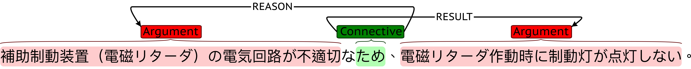

# Japanese Car Recall Corpus

[](https://github.com/nlp-titech/jp-car-recall#readme)
[](https://github.com/nlp-titech/jp-car-recall/blob/main/README.jp.md)

Japanese Car Recall Corpus is a car recall text corpus annotated with types of annotation: 1) car parts and 2) causality. This corpus is the first corpus annotating these two types of information on the car recall text. As a vehicle malfunction is related to corresponding parts, we annotate both kinds of information to explore how the domain knowledge of vehicle parts can help causality extraction.

## Data and two types of annoation

### Data

We collect recall text data from [the site](https://www.mlit.go.jp/jidosha/carinf/rcl/index.html) provided by Ministry of Land, Infrastructure, Transport and Tourism (MILT).

### Car part annotation


For car part annoation, we annoate vehicle parts as entities and the relations between parts as relations. The statistics of car part annotated documents are as follows:

- Number of Documents: 8136
- Average Document Length: 135.10

| entity   |     # |
|----------|-------|
| Parts    | 53696 |

| relation           |     # |
|--------------------|-------|
| Part-Whole         | 17219 |
| Coreference        | 17299 |
| Contact            |  9474 |
| Connect            |  5941 |
| Oneway-Coreference |   459 |

### Causality annotation


For causality annoation, we annoate malfunctions and their causes. The statistics of causality annotated documents are as follows:

- Number of documents: 6435
- Average document length: 135.27

| entity     |     # |
|------------|-------|
| Argument   | 42915 |
| Connective | 34843 |

| relation   |     # |
|------------|-------|
| REASON     | 25408 |
| RESULT     | 36544 |
| CONDITION  |  9675 |

## Data format

We annotated data with [brat](https://brat.nlplab.org/). Every annotation document is composed of a `foo.txt` file and a `foo.ann` file. Here are examples of a `foo.txt` and `foo.ann`.

`foo.txt`
```
後部反射器において、車体への取付が不適切なため、そのままの状態で使用を続けると、走行時の車体の振動により当該反射器が脱落するおそれがある。
```

`foo.ann`
```
T1	Argument 0 20	後部反射器において、車体への取付が不適切
T2	Argument 40 49	走行時の車体の振動
T3	Argument 52 60	当該反射器が脱落
T4	Connective 21 23	ため
T5	Connective 49 52	により
R1	REASON Arg1:T4 Arg2:T1	
R2	RESULT Arg1:T4 Arg2:T3	
R3	REASON Arg1:T5 Arg2:T2	
R4	RESULT Arg1:T5 Arg2:T3	
T6	Argument 24 38	そのままの状態で使用を続ける
T7	Connective 38 39	と
R5	CONDITION Arg1:T7 Arg2:T6	
R6	RESULT Arg1:T7 Arg2:T3	
```

## Corpus description and citation

For more detailed description of the corpus, please refer `paper.pdf` in this repo.
If you use this corpus in your project, please cite as
> Hsuan-Yu Kuo, Youmi Ma, and Naoaki Okazaki. 2022. Annotating Entity and Causal Relationships on Japanese Vehicle Recall Information. In Proceedings of the 36th Pacific Asia Conference on Language, Information and Computation, pages 783–791, Manila, Philippines. De La Salle University.

Or

```
@inproceedings{kuo-etal-2022-annotating,
    title = "Annotating Entity and Causal Relationships on {J}apanese Vehicle Recall Information",
    author = "Kuo, Hsuan-Yu  and
      Ma, Youmi  and
      Okazaki, Naoaki",
    booktitle = "Proceedings of the 36th Pacific Asia Conference on Language, Information and Computation",
    month = oct,
    year = "2022",
    address = "Manila, Philippines",
    publisher = "De La Salle University",
    url = "https://aclanthology.org/2022.paclic-1.86",
    pages = "783--791",
}
```

---
## License [](http://creativecommons.org/licenses/by/4.0/)

All content in this repository is licensed under the [Creative Commons - Attribution 4.0 International (CC BY 4.0)](http://creativecommons.org/licenses/by/4.0/) license.
